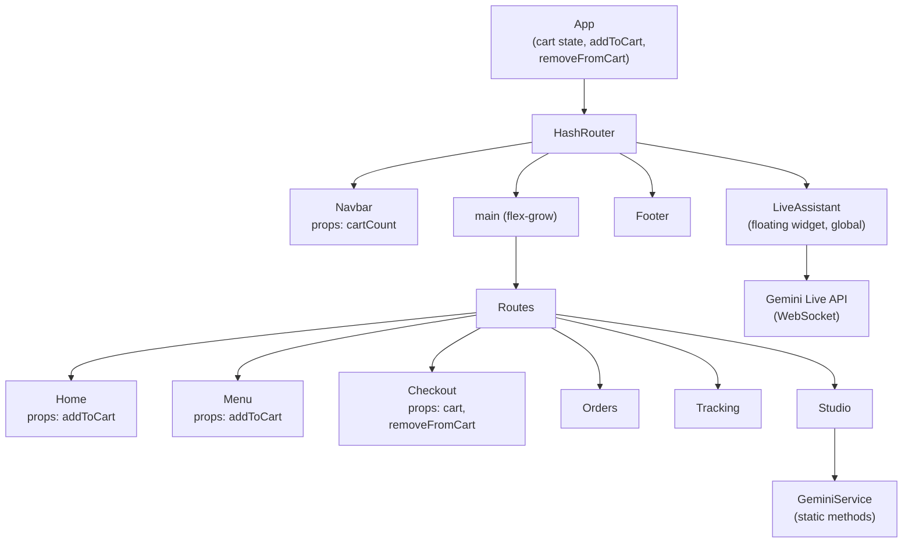
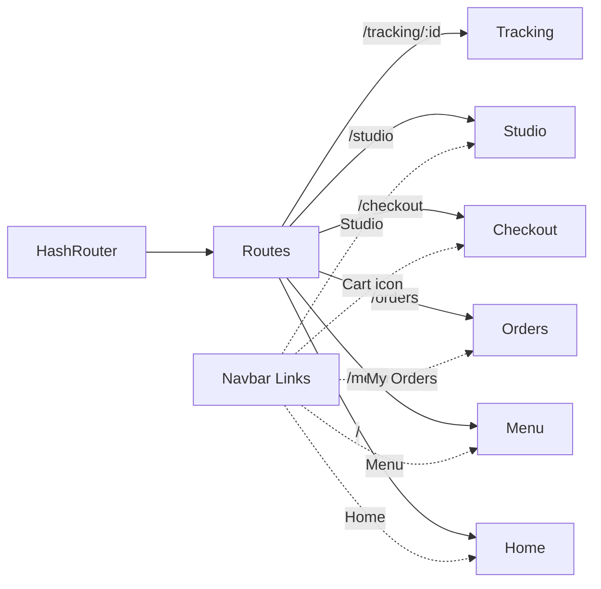
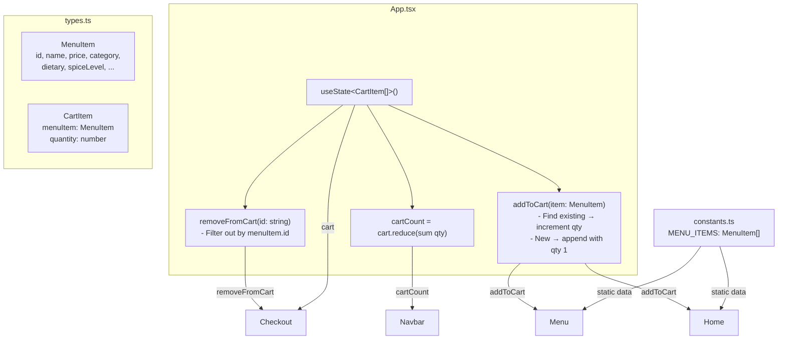
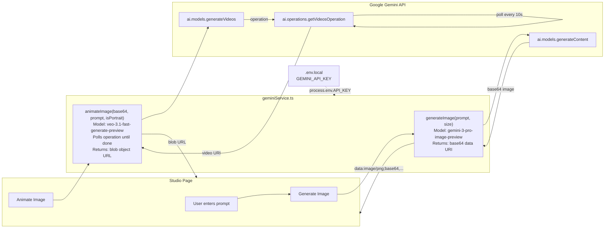
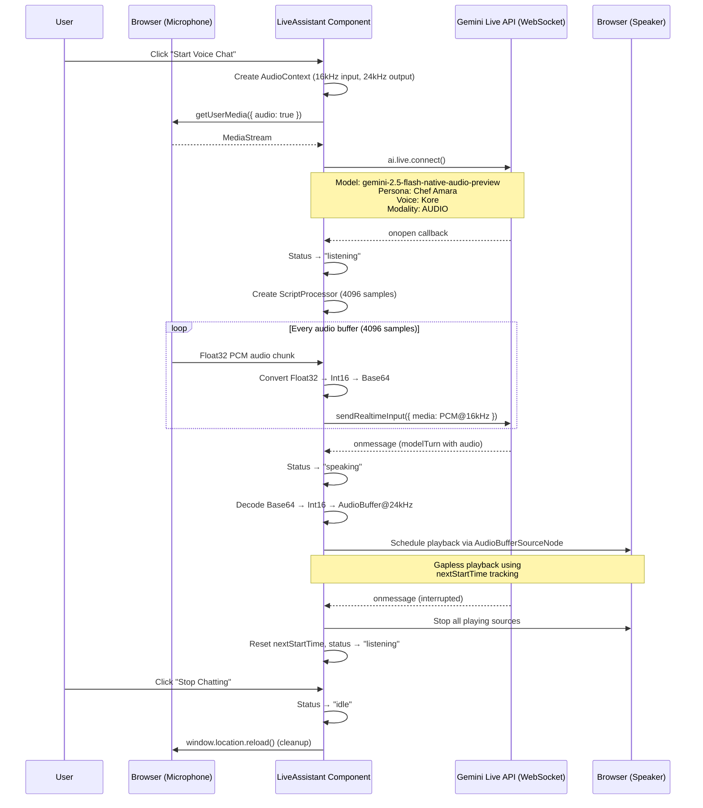
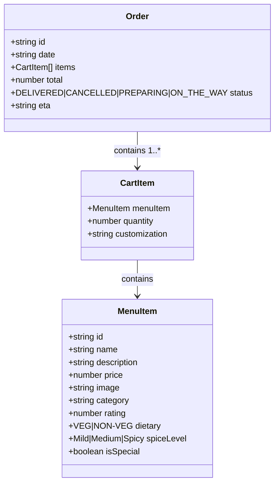

# Architecture Diagrams

Visual architecture diagrams for the Dakshin Delights project. Render with any Mermaid-compatible viewer (GitHub, VS Code Mermaid extension, etc.).

---

## 1. Component Hierarchy

---

## 2. Routing Map

---

## 3. Cart Data Flow

---

## 4. Gemini API Integration

---

## 5. LiveAssistant Audio Pipeline

---

## Data Model Summary

